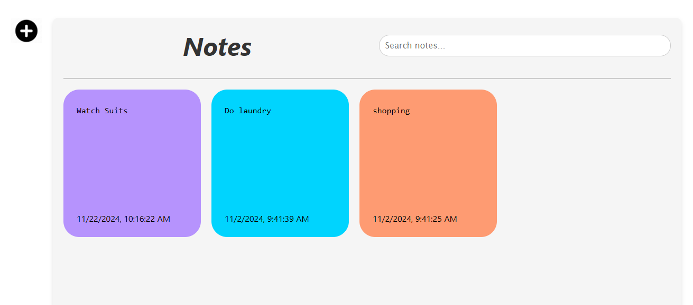

# Notes App



## Overview

The **Notes App** is a simple and intuitive application designed to help users manage their notes efficiently. It allows users to:

- Add new notes
- Delete existing notes
- Search through notes with ease

## Features

- **Add Notes**: Quickly add your thoughts or tasks.
- **Delete Notes**: Remove notes you no longer need with a single click.
- **Search Notes**: Instantly search for specific notes using the search bar.

## Getting Started

### Prerequisites

Make sure you have the following installed:

- [Node.js](https://nodejs.org/) (version 14 or higher)
- [npm](https://www.npmjs.com/) or [yarn](https://yarnpkg.com/)

### Installation

1. Clone the repository:

   ```bash
   git clone <repository-url>
   ```

2. Navigate to the project directory:

   ```bash
   cd notes-app
   ```

3. Install dependencies:

   ```bash
   npm install
   ```

4. Start the application:

   ```bash
   npm run dev
   ```

5. Open your browser and go to `http://localhost:5173` to use the app.

## Project Structure

```
├── public/
│   └── notes-app.png  # Screenshot of the application
├── src/
│   ├── components/    # React components
│   ├── styles/        # Application styles
│   └── App.js         # Main app logic
├── package.json       # Project dependencies
└── README.md          # Project documentation
```

## Technologies Used

- **Frontend**: React.js
- **Styling**: CSS
- **Search Functionality**: JavaScript

## How to Use

1. Add a note by typing in the input field and clicking the **Add Note** button.
2. Delete a note by clicking the **Delete** button next to it.
3. Search for notes using the search bar at the top.

## Screenshot


## License

This project is licensed under the MIT License - see the [LICENSE](LICENSE) file for details.
